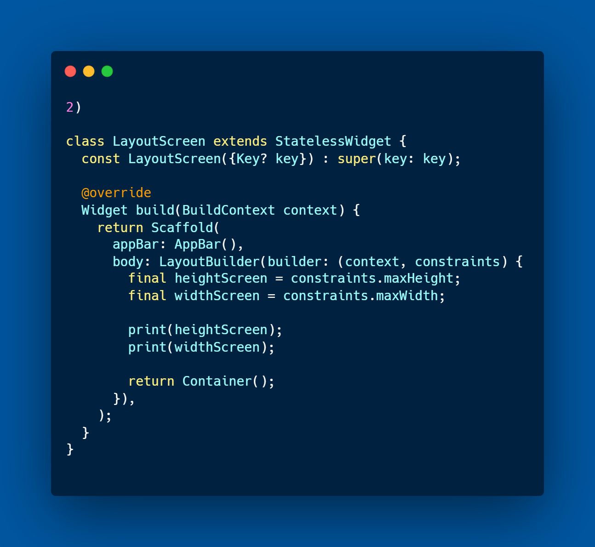
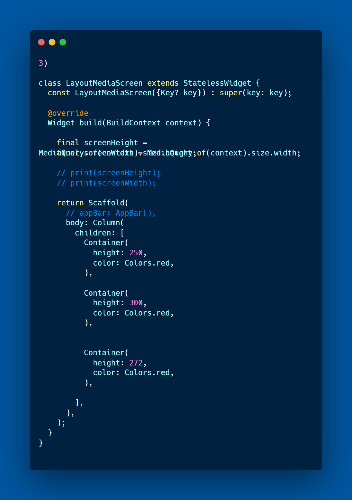
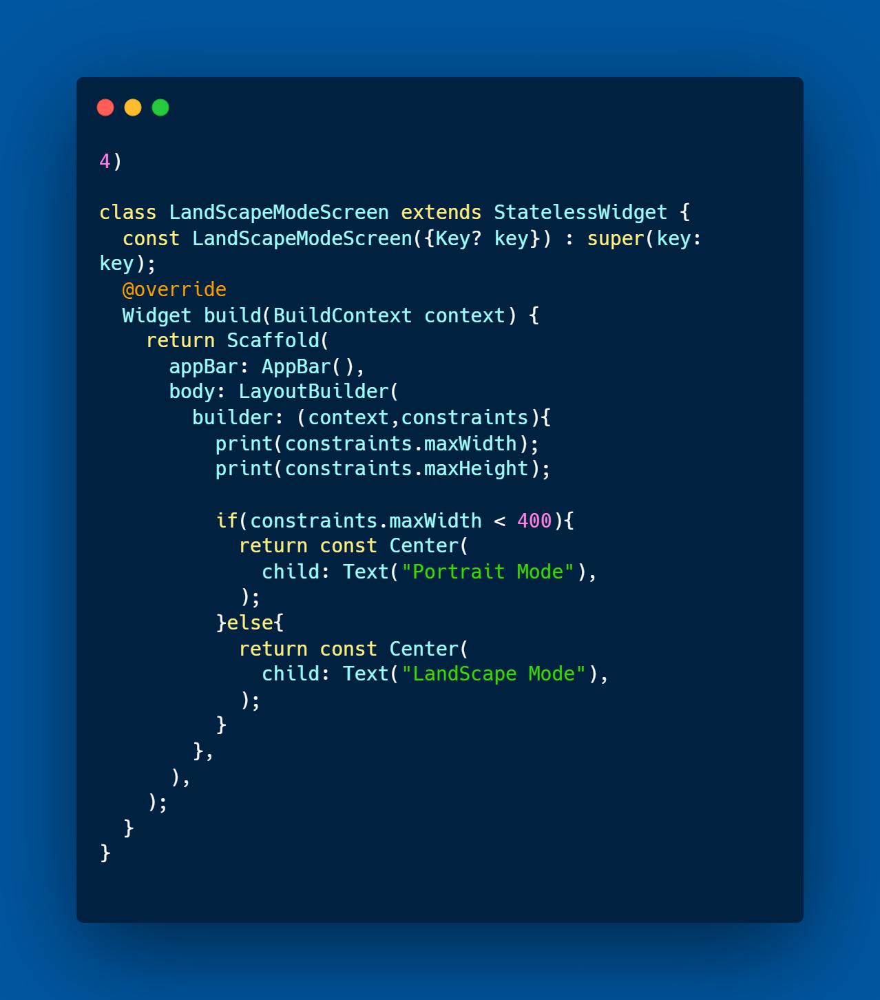
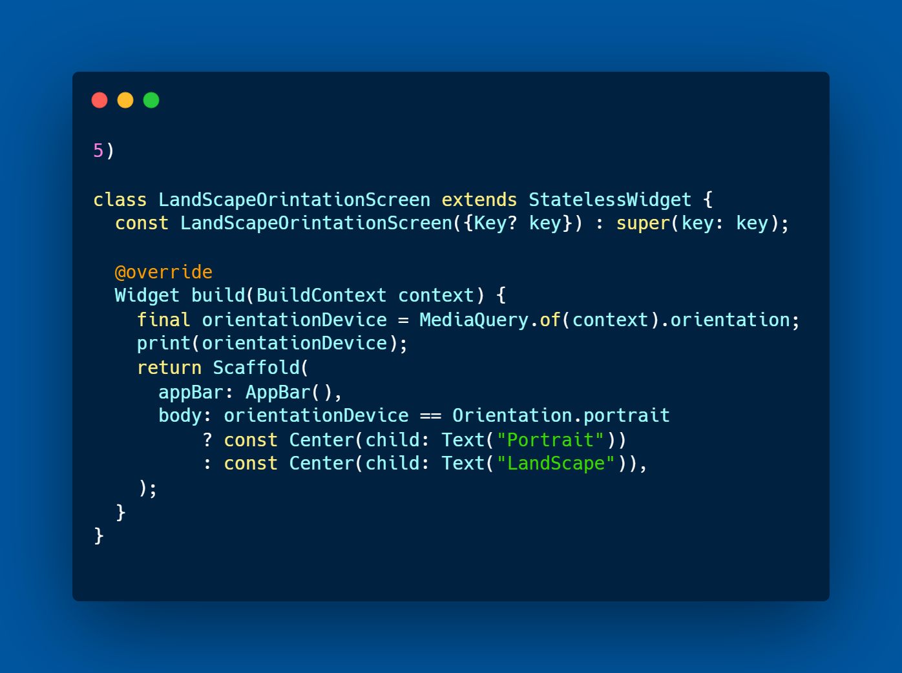
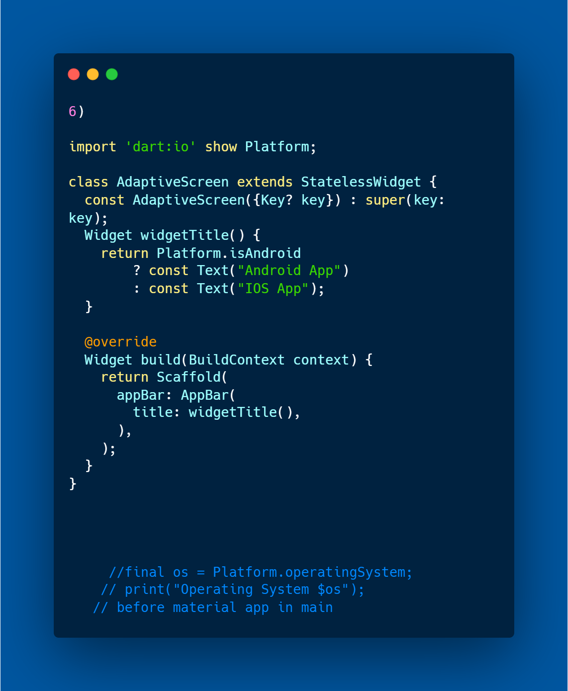

# profile_flutter

A new Flutter project.

## Getting Started

## -  Fisrt Step When Lock LandScape to avoid Rendering

## - Second Phase When add LayoutBuilder 

## - Using Phase MediaQuery  

## - Using Phase Turn On LandScape  

## - Using LandScape Orientation 

## - Adaptive Platform

