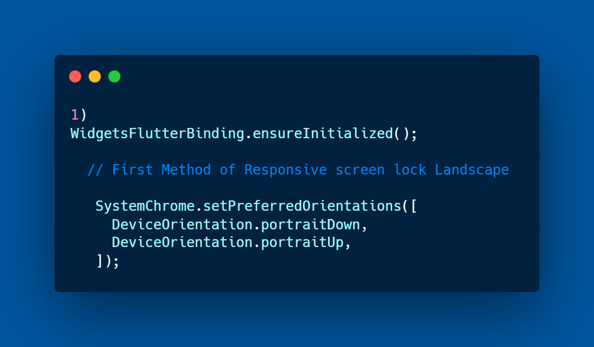

# profile_flutter

A new Flutter project.

## Getting Started

## Fisrt Step When Lock LandScape to avoid Rendering

## Second Phase When add LayoutBuilder 

## Using Phase MediaQuery  

## Using Phase Turn On LandScape  

